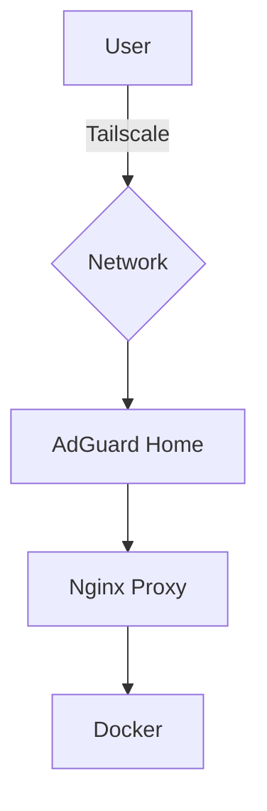

# HomeLab Infrastructure as Code (IaC)

This repository contains the configuration for my home laboratory.
The project focuses on automation, security, and observability.

---

## Architecture

Internal traffic flow:
User -> Tailscale VPN -> AdGuard Home (DNS) -> NPM (Proxy) -> Containers



## Key FeaturesUnified Dashboard: Homepage with live Docker metrics.Zero-Trust Access: Secure connectivity via Tailscale VPN.DNS Privacy: Ad-blocking and .lab domains via AdGuard Home.Observability: Metrics stack with Prometheus and Grafana.
## Deployed ServicesServiceDomainDescriptionStatusHomepagehttp://homepage.labMain DashboardOKVaultwardenhttps://vault.labPassword ManagerOKAdGuardhttp://adguard.labDNS FilteringOKNPMhttp://nginx.labReverse ProxyOKPortainerhttp://portainer.labDocker ManagementOKUptime Kumahttp://kuma.labMonitoringOKGrafanahttp://grafana.labVisualizationOK
## Usage and Maintenance
Update Infrastructure
```git pull origin main
docker compose up -d --remove-orphans
```
## BackupsConfigs: Tracked in this repository.Secrets: Managed via .env files (Git ignored).
