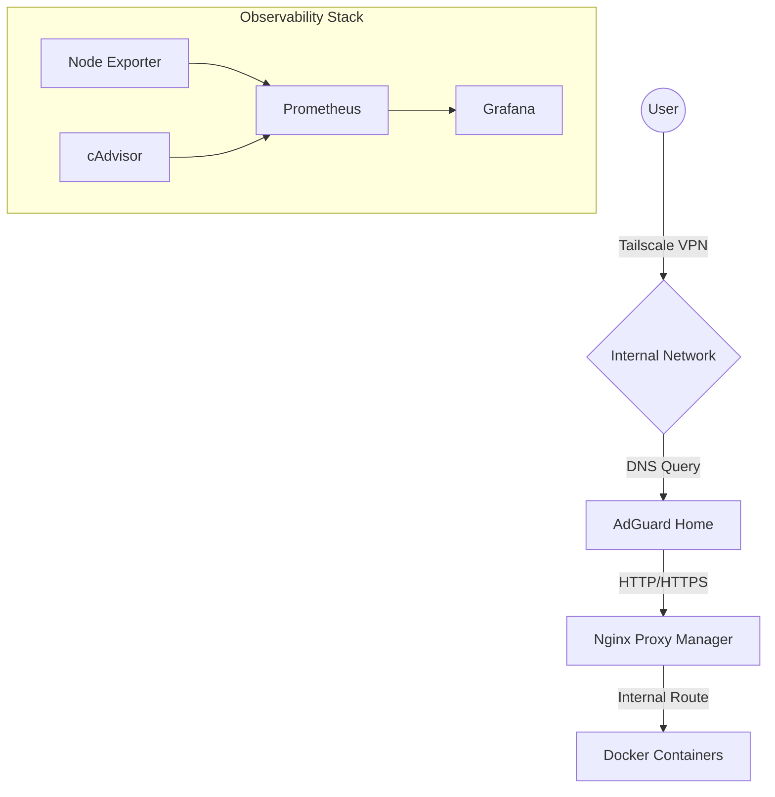

## 🚀 HomeLab Infrastructure as Code (IaC)

This repository contains the configuration files for my home laboratory environment based on a Dell OptiPlex server. The project focuses on automation, network security, and centralized management.

## 🌟 Key Features

* **Unified Dashboard:** Centralized access via Homepage with live Docker metrics (CPU/RAM).
* **Password Management:** Vaultwarden self-hosted for maximum privacy.
* **Local DNS Management:** Network-wide ad-blocking and .lab domain resolution via AdGuard Home.
* **Reverse Proxy:** SSL management and internal routing using Nginx Proxy Manager.
* **Proactive Monitoring:** 24/7 service availability checks with Uptime Kuma.
* **Metrics & Visualization:** Full monitoring stack with Prometheus, Node-Exporter, and Grafana.

## 🛡️ Security Hardening

* **Zero-Exposure:** No ports are forwarded on the router. Access to SSH, HTTP, and FileBrowser is restricted to the internal network.
* **Firewall (UFW):** Strict "Allow" policy only for the local subnet 192.168.1.0/24. All other incoming traffic is denied.
* **Remote Access:** Possible only via Tailscale VPN (Zero-Trust Remote Access).

## 🏗️ Architecture & Traffic Flow

Traffic is routed internally through the following path:

## 💻 Hardware Specification

* **Model:** Dell OptiPlex SFF
* **OS:** Ubuntu Server 24.04 LTS
* **Management:** Docker Compose & Git-based configuration.

## 📦 Deployed Services

| Service | Domain | Description | Status |
| :--- | :--- | :--- | :--- |
| **Homepage** | http://homepage.lab | Main entry point & dashboard | ✅ |
| **Vaultwarden** | https://vault.lab | Secure Password Manager | ✅ |
| **AdGuard Home** | http://adguard.lab | DNS Filtering & Rewrites | ✅ |
| **Nginx Proxy** | http://nginx.lab | Reverse Proxy UI (Port 81) | ✅ |
| **Portainer** | http://portainer.lab | Docker Management | ✅ |
| **Uptime Kuma** | http://kuma.lab | Uptime Monitoring | ✅ |
| **FileBrowser** | http://files.lab | Web File Manager | ✅ |
| **Prometheus** | http://prometheus.lab | Metrics Database | ✅ |
| **Grafana** | http://grafana.lab | Data Visualization | ✅ |
| **Node-Exporter** | Internal | Host hardware metrics | ✅ |

## 🛠️ Usage & Maintenance

To update the infrastructure:

```bash
# Sync changes from GitHub
git pull origin main


# Update and restart containers
docker compose up -d --remove-orphans

# Verify firewall status
sudo ufw status numbered
```

## 💾 Backups
Configurations: Tracked in this repository.

Secrets: Managed via environment variables and excluded from public history.

Vaultwarden: Database backups are performed from the /vw-data volume.
