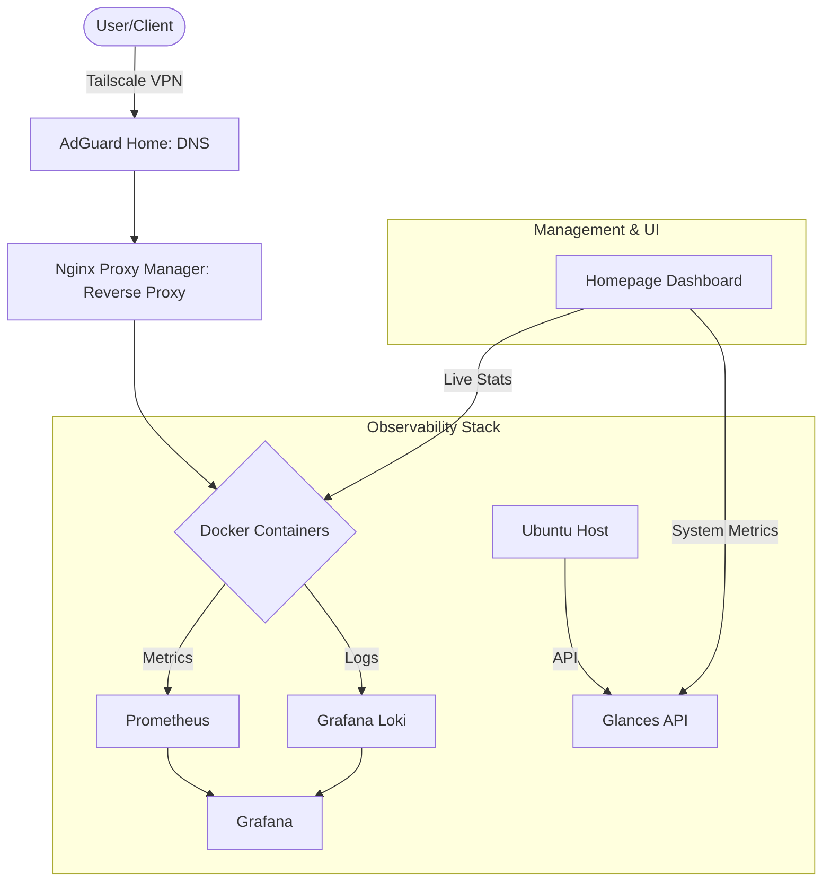

# 🚀 HomeLab Infrastructure as Code (IaC) & Observability

This repository contains the configuration files for my home laboratory environment based on a Dell OptiPlex server. The project focuses on automation, network security, and centralized observability.

## 📊 Infrastructure Architecture



## 🌟 Key Features

Unified Dashboard: Centralized access via GetHomepage with real-time API integration (CPU/RAM/Disk metrics).

Full Observability Stack: Implementation of Prometheus, Grafana, and Loki for centralized metrics and log management.

Service Monitoring: 24/7 availability checks with Uptime Kuma providing historical status bars.

Local DNS Management: Network-wide ad-blocking and .lab domain resolution via AdGuard Home.

Reverse Proxy: SSL management and internal routing using Nginx Proxy Manager.

Password Management: Vaultwarden self-hosted for maximum privacy and security.

## 🛡️ Security Hardening
Zero-Exposure: No ports are forwarded on the router. Access is restricted to the internal network.

Firewall (UFW): Strict "Allow" policy only for the local subnet. All other incoming traffic is denied.

Remote Access: Secure access via Tailscale VPN (Zero-Trust Remote Access architecture).

Secret Management: Sensitive data is managed via environment variables to prevent accidental exposure in public history.

## 🏗️ Traffic Flow
User -> Tailscale -> AdGuard Home (DNS) -> NPM (Reverse Proxy) -> Docker Container

## 💻 Infrastructure & Hardware
The environment is built on a physical Dell OptiPlex SFF host, utilizing a Proxmox/KVM Virtualization layer for optimized resource management and isolation.

#🏠 Physical Host
Model: Dell OptiPlex 7040 SFF

Physical CPU: Intel® Core™ i5 series

Total Physical RAM: 16GB DDR4

Host OS: Proxmox VE / KVM Hypervisor

#🖥️ Virtual Machine (Lab Node)
Model: QEMU Virtual Machine

vCPU: 2 Cores (QEMU Virtual CPU v2.5+)

OS: Ubuntu Server 24.04 LTS

Resource Management: Dynamic memory allocation and virtio-optimized networking.

#🌡️ Health Monitoring
Hardware and VM health are tracked via Glances API and Node-Exporter:

Resource Tracking: Real-time vCPU and RAM pressure monitoring.

Disk Health: Virtual block device monitoring with Prometheus.

Uptime: Monitored at both the VM and Service levels.

## 📦 Deployed Services

| Service | Domain | Description | Status |
| :--- | :--- | :--- | :--- |
| **Homepage** | http://homepage.lab | Main entry point & dashboard | ✅ |
| **Vaultwarden** | https://vault.lab | Secure Password Manager | ✅ |
| **AdGuard Home** | http://adguard.lab | DNS Filtering & Rewrites | ✅ |
| **Nginx Proxy** | http://nginx.lab | Reverse Proxy Management | ✅ |
| **Log Management** | http://grafana.lab | Centralized Logs (Loki) | ✅ |
| **Uptime Kuma** | http://kuma.lab | Uptime Monitoring | ✅ |
| **FileBrowser** | http://files.lab | Web-based File Manager | ✅ |
| **Prometheus** | http://prometheus.lab | Metrics Database | ✅ |
| **Grafana** | http://grafana.lab | Data Visualization | ✅ |
| **Glances** | Internal | Host hardware metrics API | ✅ |

## 🛠️ Usage & Maintenance
To sync changes and maintain the infrastructure:

```Bash

# 1. Sync current server config to repository
./backup-configs.sh

# 2. Update and restart containers
docker compose up -d --remove-orphans

# 3. Verify firewall status
sudo ufw status numbered
```

## 💾 Backups & Persistence
Configurations: All YAML and configuration files are versioned in this repository.

Automation: The backup-configs.sh script automates the collection of active configurations from the server.

Secrets: Excluded from Git history; managed via .env files and Homepage internal secret engine.

Data Volumes: Critical data (like Vaultwarden database) is stored in persistent Docker volumes for easy backup and recovery.
