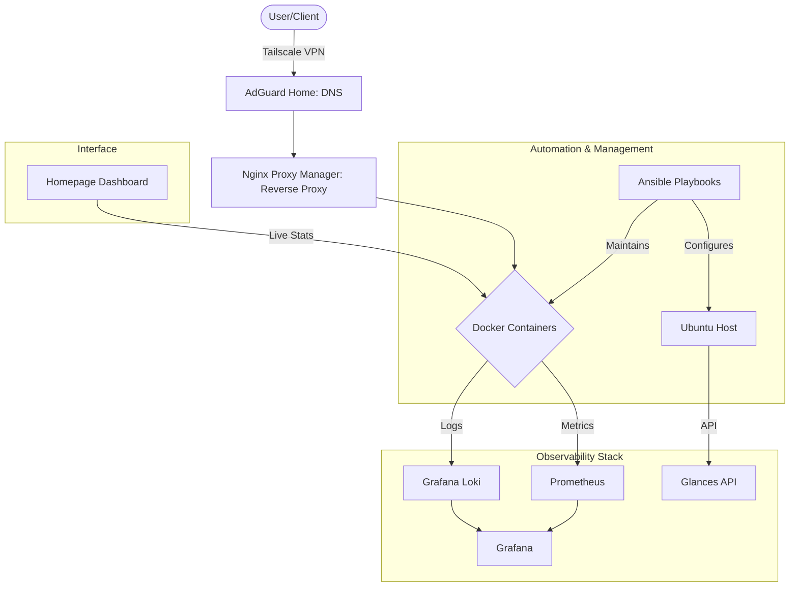

# 🚀 HomeLab Infrastructure as Code (IaC) & Observability

This repository contains the configuration files for my home laboratory environment based on a Dell OptiPlex server. The project focuses on automation, network security, and centralized observability.

## 📊 Infrastructure Architecture


## 🌟 Key Features

- **Unified Dashboard**: Centralized access via **GetHomepage** with real-time API integration (CPU/RAM/Disk metrics).
- **Full Observability Stack**: Implementation of **Prometheus, Grafana, and Loki** for centralized metrics and log management.
- **Service Monitoring**: 24/7 availability checks with **Uptime Kuma** providing historical status bars.
- **Local DNS Management**: Network-wide ad-blocking and `.lab` domain resolution via **AdGuard Home**.
- **Reverse Proxy**: SSL management and internal routing using **Nginx Proxy Manager**.
- **Password Management**: **Vaultwarden** self-hosted for maximum privacy and security.

## 🛡️ Security Hardening
- **Zero-Exposure**: No ports are forwarded on the router. Access is restricted to the internal network.
- **Firewall (UFW)**: Strict "Allow" policy only for the local subnet (192.168.1.0/24). All other incoming traffic is denied.
- **Remote Access**: Secure access via **Tailscale VPN** (Zero-Trust Remote Access architecture).
- **Secret Management**: Sensitive data is managed via environment variables and `.env` files to prevent accidental exposure in public history.

## 🏗️ Traffic Flow
User -> Tailscale -> AdGuard Home (DNS) -> NPM (Reverse Proxy) -> Docker Container

## 💻 Infrastructure & Hardware
The environment is built on a physical Dell OptiPlex SFF host, utilizing a Proxmox/KVM Virtualization layer for optimized resource management and isolation.

### 🏠 Physical Host
- **Model**: Dell OptiPlex 7040 SFF
- **Physical CPU**: Intel® Core™ i5 series
- **Total Physical RAM**: 16GB DDR4
- **Host OS**: Proxmox VE / KVM Hypervisor

### 🖥️ Virtual Machine (Lab Node)
- **Model**: QEMU Virtual Machine
- **vCPU**: 2 Cores (QEMU Virtual CPU v2.5+)
- **OS**: Ubuntu Server 24.04 LTS
- **Resource Management**: Dynamic memory allocation and virtio-optimized networking.

### 🌡️ Health Monitoring
Hardware and VM health are tracked via **Glances API** and **Node-Exporter**:
- **Resource Tracking**: Real-time vCPU and RAM pressure monitoring.
- **Disk Health**: Virtual block device monitoring with Prometheus.
- **Uptime**: Monitored at both the VM and Service levels.

## 🤖 Automation & Configuration Management (Ansible)
This project utilizes **Ansible** to enforce system state and automate repetitive maintenance tasks, moving towards a full *Infrastructure as Code* approach.

- **Inventory Management**: Defined `inventory.ini` for structured node management.
- **System Audits**: `system-check.yml` playbook for automated health and resource verification.
- **Docker Orchestration**: `docker-maintenance.yml` for automated cleanup (pruning) and container status validation.

## 📦 Deployed Services

| Service | Domain | Description | Status |
| :--- | :--- | :--- | :--- |
| **Homepage** | http://homepage.lab | Main entry point & dashboard | ✅ |
| **Vaultwarden** | https://vault.lab | Secure Password Manager | ✅ |
| **AdGuard Home** | http://adguard.lab | DNS Filtering & Rewrites | ✅ |
| **Nginx Proxy** | http://nginx.lab | Reverse Proxy Management | ✅ |
| **Log Management** | http://grafana.lab | Centralized Logs (Loki) | ✅ |
| **Uptime Kuma** | http://kuma.lab | Uptime Monitoring | ✅ |
| **FileBrowser** | http://files.lab | Web-based File Manager | ✅ |
| **Prometheus** | http://prometheus.lab | Metrics Database | ✅ |
| **Grafana** | http://grafana.lab | Data Visualization | ✅ |
| **Glances** | Internal | Host hardware metrics API | ✅ |

## 🛠️ Usage & Maintenance

To maintain the infrastructure and ensure consistency, I use a combined workflow of custom scripts and Ansible automation:

```bash
# 1. Sync current server config to repository
./backup-configs.sh

# 2. Run system health check via Ansible
ansible-playbook -i ansible/inventory.ini ansible/system-check.yml

# 3. Perform Docker cleanup and automated maintenance
ansible-playbook -i ansible/inventory.ini ansible/docker-maintenance.yml

# 4. Apply changes and restart containers
docker compose up -d --remove-orphans

# 5. Verify security status (Firewall)
sudo ufw status numbered
```

## 💾 Backups & Persistence
- **Automated Infrastructure Backup**: A dedicated **Ansible** playbook (`backup-homelab.yml`) runs daily at 3:00 AM via **Cron**. It creates compressed tarballs of the entire configuration directory with a 7-day retention policy.
- **Configurations**: All YAML, Ansible playbooks, and environment structures are versioned in this repository for full disaster recovery.
- **Secrets Management**: Sensitive data is strictly excluded from Git history. Managed via `.env` files and the **Homepage** internal secret engine.
- **Data Volumes**: Critical service data (e.g., Vaultwarden database, AdGuard configurations) is stored in persistent Docker volumes, ensuring data remains intact during container updates.
- **Manual Sync**: The `backup-configs.sh` script remains available for on-demand collection of active configurations.
